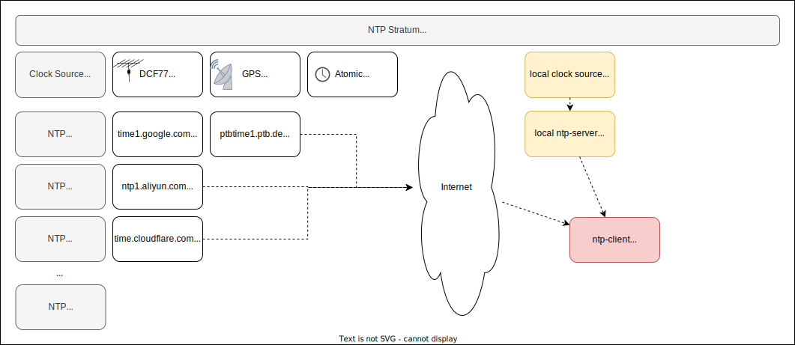

# NTP accuracy

Thoughts about NTP time accuracy and how to choose the right time source ...

The following gives an overview of the possible clock sources for NTP, the expectable accuracies and price points of ready made and DIY solutions. It won't provide specific details to fine tune a system for NTP accuracy or such.

The given accuracy numbers are based on data sheets, internet publications and own experiments. They are meant to give an orientation, actual values may vary for diverse reasons.

---

## Required Accuracy

### Use Cases

If you just want to set the date & time of a desktop PC for "everyday use" and the added comfort of automatic time adjustments, an accuracy of 100 ms (or even worse) is usually good enough.

If you need to time synchronize some machines on the (local) network, the required accuracy really depends on the specific use case.

### Rough Estimates

Some "ballpark figures" what a specific setup may be able to provide at the NTP client. Your mileage may vary, in question (or if you need reserves) use a better setup.

100 ms

Using NTP in a "default setup" should work.

10 ms

Using carefully selected internet NTP servers and have a look at the network setup (e.g. avoid Wi-Fi), 10 ms accuracy should be possible.

1 ms

A well crafted local NTP server (using GPS+PPS) and network may be able to provide 1 ms accuracy. TODO: Check this with a good local NTP server and a connected client.

microseconds

Better use PTP (precision time protocol) or such, usually requires dedicated HW / SW.

---

## Official Time

The source of the official time are extremely accurate atomic clocks:

GPS time will have an accurracy of 1-10 ns: https://web.archive.org/web/20121028043917/http://tf.nist.gov/time/commonviewgps.htm

## NTP Stratum

The stratum is the count of NTP server hops from a clock source like GPS or DCF77 to an NTP server or client. An NTP server directly connected to such a clock source has the stratum 1. Each NTP server hop increases the stratum by one.

Typical internet NTP servers have a stratum of 1, 2 or 3. As an NTP client has a stratum increased by one, its stratum will be usually 2, 3 or 4.

Stratum 16 marks an unsynchronized NTP server and values higher than 16 aren't valid.

Please be aware: In practice, the stratum isn't a good indicator for the expectable accuracy. For example: Here in germany, the stratum 3 servers from cloudflare usually have a much higher accuracy compared to the stratum 2 servers from aliexpress.

## Accuracy Values

TODO: Add infos about the accuracy values in question: offset to official time, jitter, reliability, ...

## Accuracy Measurement
Measuring the accuracy of an NTP server can be done by comparing the time with a known good reference time. Such a test methodology is described in: "TimeMachines Time Server Accuracy TM1000A and TM2000A/B and TM2500B" (https://timemachinescorp.com/wp-content/uploads/TMTimeServerAccuracyRevB.pdf).

Unfortunately, a highly precise reference time is pretty expensive. For example, an "enterprise grade" NTP/PTP server like the GPS based *MICROCHIP SyncServer S600* delivers a typical (RMS) accuracy <15 ns at a price tag of 18k €.

An alternative is to use a time reference with a good "Estimated Error" as displayed by chronyc, which is very often used in internet publications. Well crafted DIY NTP servers using GPS+PPS (see below) may provide accuracies of 50 us. If you're on a budget its the best you can do, as even medium priced equipment will often not even state the accuracy in the data sheet at all or only mentions it vaguely, like: "around 10 ms".

---

## Clock Sources

There are several possible clock sources (GPS, radio clock, ...) to get a - hopefully - accurate current time. Every stratum 1 NTP server uses such a (stratum 0) clock source.

### Overview
Here is an overview of the clock sources:

| Source | Typical Accuracy Range | Remarks |
| --- | --- | --- |
| GPS | 1 - 50 ms |
| GPS+PPS | 15 ns - 1 ms | PPS: Pulse per second signal
| Radio clock | 5 - 25 ms | e.g. DCF77 |
| Atomic clock | ? | Probably too expensive for common use |
| Telephone modem | ? | Limited practical use today |

Hint: Usually GPS (or better GPS+PPS) is used as the clock source for stratum 1 NTP servers today.

### GPS

GPS can provide a pretty accurate time signal.

The serial data stream (RS232 or USB) provided by common GPS receivers includes the *GPS time* (https://en.wikipedia.org/wiki/Global_Positioning_System#Timekeeping). While that time is pretty accurate in general, the serial data transfer limits the accuracy to a typical 1 ms (or worse) due to latency, jitter and data processing time.

Modern GPS receiver chipsets may receive signals not only from GPS (USA), but also from similar systems like: Galileo (EU), GLONASS (Russia), BeiDOU (China), ... However, "GPS antennas" may only support a specific frequency range which isn't suitable for all systems. In question consult the data sheets.

Advantages:
- best accuracy 1 ms (up to 50 ms depending on HW/SW used)
- no internet connection needed
- usable worldwide
- medium priced (Aliexpress FC-NTP-Mini: <100 €, TimeMachines TM1000A: 350 €)

Disadvantages:
- clear sky view needed
- indoor use only with external antenna

### GPS+PPS
In addition to the GPS serial data (as mentioned above) providing maybe 1 ms accuracy, specialized GPS hardware can provide a PPS signal (https://en.wikipedia.org/wiki/Pulse-per-second_signal) that provides nanosecond accuracy.

The "trick" is to take the serial GPS data (even with a "poor" accuracy of maybe 50ms) for the coarse date&time and use a highly accurate "PPS one second pulse" with low latency/jitter HW to adjust the actual start of a second with high accuracy.

GPS receiver module data sheets often states a PPS accuracy of 10-20 ns, the GPS-Time itself should have a typical accuracy of 1-10 ns: https://web.archive.org/web/20121028043917/http://tf.nist.gov/time/commonviewgps.htm. Equipment like the MICROCHIP SyncServer S600 mentioned above are probably using such a setup together with dedicated HW to provide accuracy of 15 ns. But even low/medium priced PC HW together with well crafted GPS DIY can provide NTP accuracy < 50us which is far better than using serial GPS data alone.

Advantages:
- typical accuracy maybe 50 us (range highly depends on the HW/SW used: 15 ns - 1 ms)
- no internet connection needed
- usable worldwide
- DIY medium priced (GPS receiver 10-100 €, depending on the HW used)

Disadvantages:
- clear sky view needed
- indoor use only with external antenna
- ready made devices are high priced (MICROCHIP SyncServer S600: 18k €) - are there cheaper alternatives?

### Radio clock (DCF77)
There are many radio clock sources available around the world (see: https://en.wikipedia.org/wiki/Radio_clock and RFC5095 "Figure 12: Reference Identifiers"). Probably the best known are:

- DCF77, 77,5 kHz, Frankfurt (Mainflingen), Germany
- JJY, 40/60kHz, Japan
- WWVB, 60kHz, USA

Advantages:
- no internet connection needed
- indoor use possible (may or may not work)
- cheap DIY (Antenna < 10 € + "some spare parts")

Disadvantages:
- typical accuracy 5-25 ms (DCF77)
- location range limited (DCF77: 2000km around Frankfurt)
- weak reception possible (reinforced concrete, "big motor" interferences, ...)
- ready made devices 1000 € (DCF77: Gude 3011)

### Atomic Clock

To run an own atomic clock is at least costly only for "everyday use". Institutions that run their own atomic clock will probably now much better than I do about strengths and weaknesses ;-)

### Telephone modem

Telephone modems seems to have a relatively poor accuracy and used only on older existing setups.

---

## NTP Server

With using NTP, the main (accuracy) question is wether to depend on internet NTP servers alone or if its necessary to set up a local server. In both cases NTP clients can use multiple servers for higher reliability and accuracy.

### Overview

| Source | Typical Accuracy | Accuracy Range | Remarks |
| --- | --- | --- | --- |
| Internet NTP Server | 15 ms | 10-200 ms | Accuracy highly depends on the servers used
| Local NTP server | - | - | Accuracy depends on the local clock source (GPS, DCF77, ...)

### Internet NTP Server
There are many NTP servers available on the internet. The accuracy highly depends on the servers used. Not all servers support NTS (network time security).

Some examples with values I've seen at home **in germany** ("Expected Error" from chronyc) over a few days:

| Source | Stratum | Typical Error | Error Range | Server | Supports NTS? | Remark |
| --- | --- | --- | --- | --- | --- | --- |
| Google | 1 | 15 ms | 10 - 200 ms| time1.google.com, time2.google.com, time3.google.com, time4.google.com | no |very often 10-20 ms
| Cloudflare | 3 | | | time.cloudflare.com | yes |
| Alibaba | 2 | | | ntp1.aliyun.com, ntp2.aliyun.com, ntp3.aliyun.com, ntp4.aliyun.com | ? |
| de.pool.ntp.org | | | | 0.de.pool.ntp.org, 1.de.pool.ntp.org, 2.de.pool.ntp.org, 3.de.pool.ntp.org | ? | actual server and accuracy varies |
| de.pool.ntp.arcor-ip.net | | | | de.pool.ntp.arcor-ip.net | ? | NTP server from my internet provider |

Values are taken from chronyc "Estimated Error" output.

TODO: Add some more detailed numbers into the table

Advantages:
- indoor use possible
- usable worldwide
- only internet cost

Neutral:
- 10-15 ms typical "Estimated Error" (if using good servers)

Disadvantages
- accuracy depends on external servers
- internet connection needed
- potential (low?) security risk

### Local NTP Server

Placing an NTP server in the local network provides more control and usually a higher accuracy.

Advantages:
- usable worldwide
- accuracy down to microseconds typical "Estimated Error"
- accuracy only depends on "own equipment"
- no internet connection needed
- low security risk (compared to internet servers)

Neutral:
- if indoor use is possible depends on clock source

Disadvantages
- additional cost

### Network Influence

How much the network influences the time accuracy depends on many factors:

* Ethernet switches: Store-and-Forward vs Cut-Through
* Network load
* SW vs. HW firewalls and routers
* ...

The highest influence I've seen on my network is using Wi-Fi instead of an Ethernet cable which increases the "Estimated Error" of chronyc by 1-3 ms.

## Example NTP Server Equipment

Some example NTP server devices for price/accuracy orientation (2024.12):

| Model | GPS or DCF77 | Accuracy | Price | Remarks |
| --- | --- | --- | --- | --- |
| Microchip SyncServer S600 | GPS | < 16 ns RMS | 18000 € | Yes, the data sheet states nano seconds!
| (TXT) MA-802 | GPS | <1 ms | Aliexpress 750 € |
| TimeMachines TM1000A | GPS | +-1 ms | 350 € |
| Meinberg LANTIME M300 | GPS | ~10 ms | 5000 € |
| Gude 3011 | DCF77 | ? ms | reichelt 1000 € |
| FC-NTP-MINI | GPS | +- 1 ms | Aliexpress ~70 € | Reviews report problems with ntpd clients (e.g. Unraid, OPNsense, PfSense): https://www.elkoba.com/magazin/service-info-zum-ntp-server-gps-fc-ntp-mini/ |
| ALLNET ALLNTP101 | GPS | ? ms | reichelt 200 € | Seems to be the same device as FC-NTP-MINI |

Remarks:
* for many devices I couldn't find a statement about the accuracy in the data sheets or elsewhere
* wether GPS or GPS+PPS is used is usually not stated
* in question, contact the manufacturer / distributor for details
